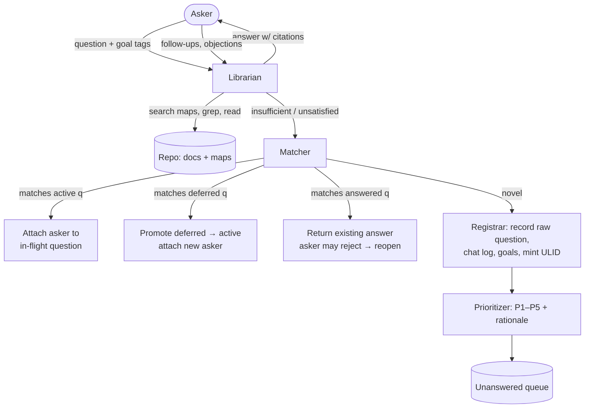
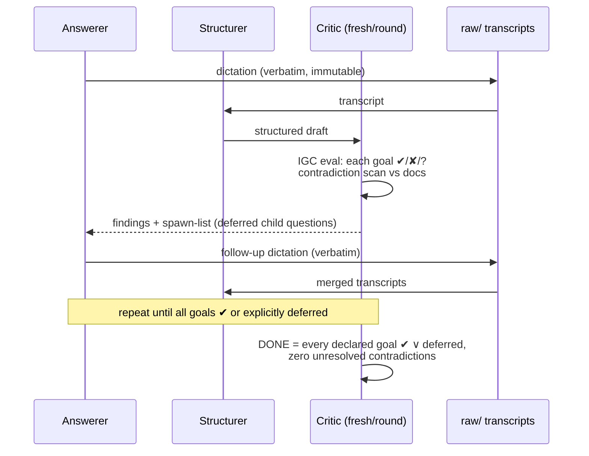
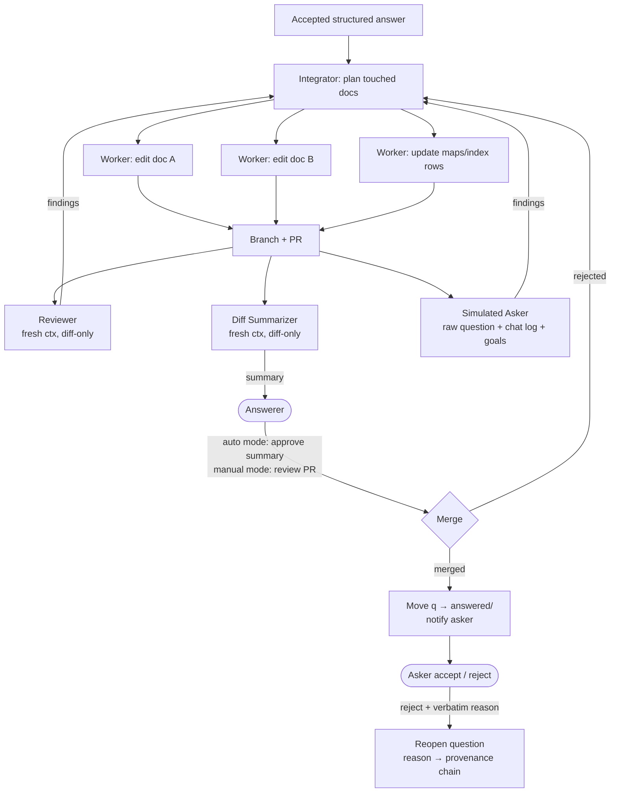
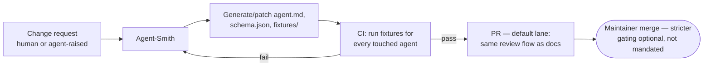
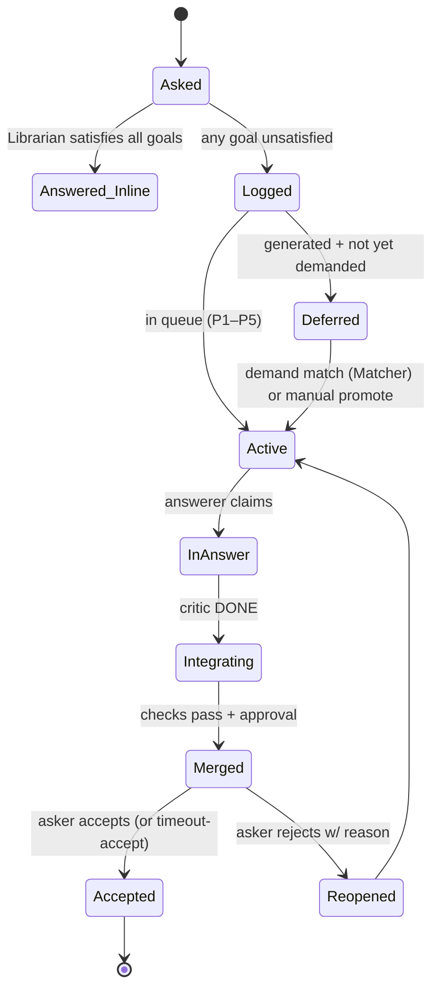

# Ultradyn Docs — Agent Architecture & Loops

Document 2 of 6 · Companion visual: `architecture.html`

The design uses the standard composable workflow patterns (prompt chaining, routing, orchestrator–workers, evaluator–optimizer) plus narrowly-scoped agents exposed as MCP tools. Every agent is defined by a file in the repo (`agents/<name>/agent.md` + `schema.json` + `fixtures/`), instantiated with fresh context per invocation, and constrained by a structured output schema — the interface, not just the prompt, keeps agents on task.

---

## 1. Agent roster

| Agent | Pattern role | Input → Output (structured) | Fresh ctx |
|---|---|---|---|
| **Librarian** | Retrieval + chat | question, chat history → answer w/ doc citations, or `insufficient` | per conversation |
| **Goal Clerk** | Routing helper | raw question → suggested goal tags from `goals/vocabulary.md` | yes |
| **Registrar** | Deterministic-ish intake | question, goals, chat log → question record (ULID, files, index rows) | yes |
| **Matcher** | Routing / dedup | new question → semantic matches in active + deferred + answered queues | yes |
| **Prioritizer** | Rule application | question record + provenance → P1–P5 + one-line rationale | yes |
| **Structurer** | Chaining step | raw transcript(s) → structured answer draft | shares answer session |
| **Critic** | Evaluator (in evaluator–optimizer) | draft + goals + doc excerpts → per-goal ✔/✘/? findings; contradictions; spawn-list | yes, per round |
| **Integrator** | Orchestrator–workers | accepted answer → doc edit plan → worker edits → branch + PR | yes |
| **Reviewer** | Independent evaluator | question, answer, **diff only** → approve / findings | yes (mandatory) |
| **Diff Summarizer** | Independent reporter | **diff only** → plain-language change summary for answerer | yes (mandatory) |
| **Simulated Asker** | Independent evaluator | raw verbatim question + chat log + goals + proposed answer → "does this answer *my* question?" | yes (mandatory) |
| **Agent-Smith** | Meta (orchestrator) | agent request → new/updated agent file + schema + fixtures, via PR | yes |

"Fresh ctx: mandatory" marks the evaluation-isolation constraint (C6): these agents must never share context with the producer of what they evaluate — a summarizer that saw the integrator's plan summarizes intent, not the diff.

## 2. Loop A — Ask (routing + retrieval)



Notes: the Librarian does the semantic work of retrieval itself (agentic navigation over readable maps; ephemeral BM25 as an optional tool). "Insufficient" is decisive per goal — a question can be answered for `implementation` and logged for `security-review`.

## 3. Loop B — Answer (evaluator–optimizer)



The critic's spawn-list becomes child questions via the Registrar with provenance `{parent: qID, finding: fID, goal: g}`, tags `generated`, optionally `extra-detail`, and a Prioritizer pass (depth decay default; contradiction ⇒ P1 regardless of depth).

## 4. Loop C — Integrate (orchestrator–workers + independent checks)



## 5. Loop D — Self-modification (Agent-Smith)



Golden fixtures per agent (known inputs → expected structured outputs) are the contract that makes generated agents testable and catches upstream model drift. Deployment may run this lane relaxed (team decision); the mechanism is cheap either way because fixtures are generated with the agent.

## 6. Priority rules (fitted guidelines, not arithmetic)

```
P1  contradiction-spawned; asker-rejected reopened questions
P2  unsatisfied goal on an active question; promoted-by-demand deferred questions
P3  raw questions, default
P4  generated depth-1 children (no contradiction)
P5  generated depth-2+ children; tagged extra-detail
```
Every assignment ships with a one-line rationale and is human-overridable. Rules live in `goals/priority-rules.md` and are themselves PR-editable.

## 7. Question lifecycle (single source of truth)


