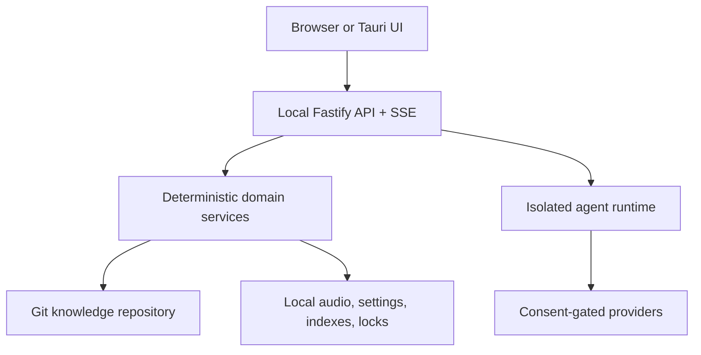

# Architecture

## Product boundary

Ultradyn Docs is a local-first server and browser application over one documentation repository. The Tauri shell launches the same server contract; it is not a second implementation.

The server binds to loopback by default. It validates the HTTP `Host` and
browser `Origin`; a marked same-origin POST establishes an unguessable HttpOnly,
`SameSite=Strict` session before protected web requests, while explicit
navigation remains the different-server override. A stale session rejection
triggers one deduplicated bootstrap and request replay; a dropped SSE stream
keeps bootstrapping until it can reconnect. This POST works on
plain-HTTP hostnames where browsers omit Fetch Metadata without allowing an
ordinary cross-site navigation or form to mint the cookie. Wildcard binds fail
closed without an explicit hostname allowlist. This is request hardening for a
trusted local application, not user identity or multi-tenant authorization;
place any remote deployment behind a trusted authenticating TLS proxy.

## Portable repository

- `docs/`: documentation and committed `_map.md` projections.
- `questions/{active,deferred,answered}/`: canonical question directories grouped by queue bucket.
- `goals/`: goal definitions and priority rules.
- `agents/`: runtime agent prompts, schemas, and contract fixtures.
- `code/`: inspectable application source snapshot.
- `settings/project.json`: non-secret project settings.
- `.ultradyn/manifest.json`: schema and originating package versions.

Local state uses platform config/data directories keyed by repository ID. It includes personal settings, consent receipts, raw/converted audio, worktrees, local change-request metadata, locks, and maintenance cursors. Personal settings include a canonical actor handle used for provenance on local human actions. The shared web context loads it once and role actions fail closed when it is absent; asker decisions additionally require an exact pending-ID match. That handle is attribution inside the trusted-team model, not authentication. Delegated credentials remain with their owning client/environment; Ultradyn stores only consent and source identifiers.

## Deterministic shell

Domain state transitions, ULIDs, raw immutability, atomic writes, question-index regeneration, settings precedence, audio chunk order, codec verification, Git branches/worktrees, and JSON Schema validation are deterministic library code. These paths are tested through public filesystem, repository, process, and HTTP seams. General documentation-map regeneration and CI wiring for integrity checks remain unfinished.

## Generative interior

Agent definitions are loaded from `agents/<name>/`. Each invocation is a new provider request and must validate against the agent's JSON Schema before the output is accepted. Evaluator input policies are enforced by the runtime, not left to prompt wording.

- Librarian: maps/search/read → cited answer or per-goal insufficiency.
- Goal Clerk: goal suggestions only.
- Matcher: semantic candidate ordering; deterministic services perform reuse/promotion.
- Structurer: immutable transcripts/corrections → derived answer.
- Critic: per-goal decisive evaluation, contradictions, and deferred depth.
- Integrator: proposes touched documents; Git service creates the actual change request.
- Reviewer, Diff Summarizer, Simulated Asker: isolated checks over restricted inputs.
- Agent-Smith: proposes definitions, schemas, and fixtures through the same change-request lane.

## Retrieval

Readable maps and direct file reads are primary. MiniSearch builds an in-memory text index from the current `docs/` tree for each retrieval operation. Embeddings are deliberately absent from v1; a selected LLM can perform semantic matching without adding a nonportable vector database.

## Change requests

The local backend creates an isolated worktree, `ultradyn/<qid>` branch, actual diff, check artifacts, explicit approval, and a local merge. Branch-head mutations and portable base-branch changes invalidate approval; managed question/settings checkpoints may advance independently. Disabling automatic checkpoint commits leaves those paths uncommitted and exposes one explicit pending checkpoint in Maintenance. It does not yet enforce auto/manual mode, automatically rebase/re-plan, or make its review metadata portable. The GitHub provider has polling and `gh pr create` primitives, but approved local change requests are not wired to remote publication. Maintenance polling creates visible local review/re-review tasks; task claiming and remote review actions are not implemented.

See ADRs under `docs/adr/` for reconciled lifecycle, state, packaging, and Git decisions.
