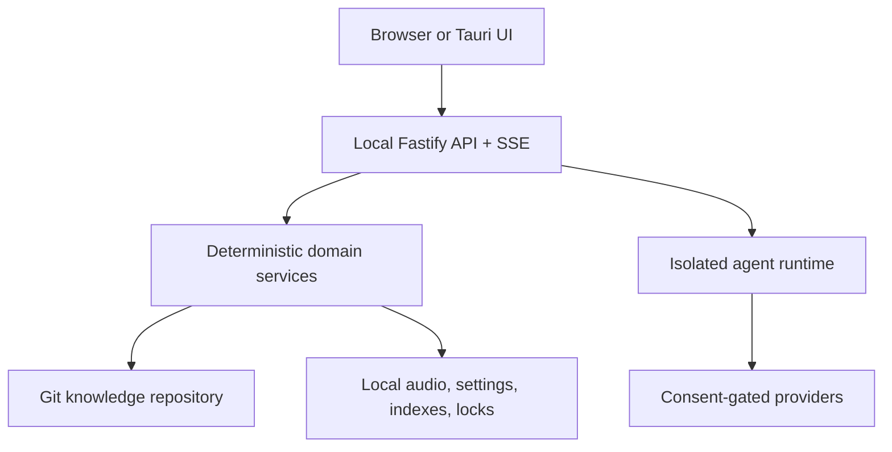

# Architecture

## Product boundary

Ultradyn Docs is a local-first server and browser application over one documentation repository. The Tauri shell launches the same server contract; it is not a second implementation.

The server binds to loopback by default. It validates the HTTP `Host` and
browser `Origin`; a marked same-origin POST establishes an unguessable HttpOnly,
`SameSite=Strict` session before protected web requests, while explicit
navigation remains the different-server override. A stale session rejection
triggers one deduplicated bootstrap and request replay; a dropped SSE stream
keeps bootstrapping until it can reconnect. This POST works on
plain-HTTP hostnames where browsers omit Fetch Metadata without allowing an
ordinary cross-site navigation or form to mint the cookie. Wildcard binds fail
closed without an explicit hostname allowlist. This is request hardening for a
trusted local application, not user identity or multi-tenant authorization;
place any remote deployment behind a trusted authenticating TLS proxy.

## Portable repository

- `docs/`: documentation and committed `_map.md` projections.
- `questions/{active,deferred,answered}/`: canonical question directories grouped by queue bucket.
- `goals/`: goal definitions and priority rules.
- `agents/`: runtime agent prompts, schemas, and contract fixtures.
- `code/`: inspectable application source snapshot.
- `settings/project.json`: non-secret project settings.
- `.ultradyn/manifest.json`: schema and originating package versions.

Local state uses platform config/data directories keyed by repository ID. It includes personal settings, consent receipts, raw/converted audio, worktrees, local change-request metadata, locks, and maintenance cursors. Transient in-repository question creation uses `.ultradyn/staging/`, which is ignored in both the source and generated repositories. Personal settings include a canonical actor handle used for provenance on local human actions. The shared web context loads it once and role actions fail closed when it is absent; asker decisions additionally require an exact pending-ID match. That handle is attribution inside the trusted-team model, not authentication. Delegated credentials remain with their owning client/environment; Ultradyn stores only consent and source identifiers.

## Deterministic shell

Domain state transitions, ULIDs, raw immutability, atomic writes, question-index regeneration, settings precedence, audio chunk order, codec verification, Git branches/worktrees, and JSON Schema validation are deterministic library code. These paths are tested through public filesystem, repository, process, and HTTP seams. General documentation-map regeneration and CI wiring for integrity checks remain unfinished.

## Generative interior

Agent definitions are loaded from `agents/<name>/`. Each invocation is a new provider request and must validate against the agent's JSON Schema before the output is accepted. Evaluator input policies are enforced by the runtime, not left to prompt wording.

- Librarian: maps/search/read → cited answer or per-goal insufficiency.
- Goal Clerk: goal suggestions only.
- Matcher: semantic candidate ordering; deterministic services perform reuse/promotion.
- Structurer: immutable transcripts/corrections → derived answer.
- Critic: per-goal decisive evaluation, contradictions, and deferred depth.
- Integrator: proposes touched documents; Git service creates the actual change request.
- Reviewer, Diff Summarizer, Simulated Asker: mandatory isolated checks over restricted inputs. The change request persists the verbatim question, explicit verbatim chat (including an empty string), and declared goals; Simulated Asker output must cover every goal exactly once.
- Agent-Smith: proposes definitions, schemas, and fixtures through the same change-request lane.

## Retrieval

Readable maps and direct file reads are primary. MiniSearch builds an in-memory text index from the current `docs/` tree for each retrieval operation. Embeddings are deliberately absent from v1; a selected LLM can perform semantic matching without adding a nonportable vector database.

## Change requests

The local backend creates an isolated worktree, attempt-specific `ultradyn-attempts/<change-request-id>` branch, actual diff, mandatory fresh Reviewer/Diff Summarizer/Simulated Asker checks, explicit approval, and a local merge. The separate namespace coexists with legacy `ultradyn/<qid>` refs without migrating or deleting user branches. The stored request binds those evaluators to a deterministic fingerprint of the verbatim question/chat, exact ordered goals, structured answer, and proposed files/content. Every production integration submits the current tuple through `ensureCurrent`; stored proposal files remain canonical on retry, so Integrator is not rerun merely to compare nondeterministic output. Identical input reuses the active attempt; changed input supersedes it while preserving its branch/worktree and any dirty user bytes.

Attempt creation and supersession are serialized by one machine-local lock and a durable pre-mutation journal. Normal reads reconcile interruption after journal, worktree, proposal commit, new metadata, prior supersession, or journal-cleanup boundaries. A dirty journaled worktree blocks recovery without deleting tracked or untracked bytes. Reopened questions receive a new attempt identity, and merged records remain historical. Schema-version-1 records migrate to version-2 read models; when exact historic evaluator input is unavailable, the record is marked `legacy-unavailable` and cannot authorize evaluation, approval, or merge.

Fake or absent evaluator results keep a current request blocked. Branch-head mutations and portable base-branch changes invalidate approval; managed question/settings checkpoints may advance independently. Before Git advances the base branch, a durable merge intent records the exact base and reviewed branch heads plus a SHA-256 binding to the approved record identity, evaluator input, diff, checks, approvals, actor, and time. Every read and reconciliation validates that authorization snapshot; intent alone cannot authorize a merge. Restart reconciles only the exact two-parent merge commit, then completes merged metadata and verified manager-owned worktree cleanup without replaying the merge. Cleanup refuses tracked or untracked dirt and preserves the intent for retry; only a clean registered worktree is removed, without force. Disabling automatic checkpoint commits leaves managed paths uncommitted and exposes one explicit pending checkpoint in Maintenance. The backend does not yet enforce auto/manual mode, automatically rebase/re-plan, or make review metadata portable. The GitHub provider has polling and `gh pr create` primitives, but approved local change requests are not wired to remote publication. Maintenance polling creates visible local review/re-review tasks; task claiming and remote review actions are not implemented.

Question records are strict at the top level and in nested asker, origin, and provenance records; only the explicit provenance `details` extension object is open. Ask and persistence reject duplicate goals while retaining the submitted order of distinct goals. Explicit rejection is a single locked, journaled repository transaction from immutable reason publication through decision and P1 reopen.

Draft-07 cannot express uniqueness of an object property within an array, and its string-length semantics count Unicode code points rather than JavaScript UTF-16 code units. The shipped schemas use standard `uniqueItems` for identical asker objects, `x-uniqueBy: "id"` for the stronger invariant, and `x-utf16MinLength`/`x-utf16MaxLength` beside bounded strings to match canonical Zod behavior. Portable integer fields that map to Zod integers carry explicit `Number.MIN_SAFE_INTEGER`/`Number.MAX_SAFE_INTEGER`-compatible bounds; current nonnegative fields therefore use `0..9007199254740991`. Portable consumers must register the complete shipped schema set with `createPortableSchemaValidator` from `code/domain/index.ts` and validate by schema name. That production validator enforces the extension keywords plus the calendar-valid explicit-offset date-time format used by Zod. Compiling an individual JSON file with a validator that ignores unknown keywords, counts only Unicode code points, accepts unsafe integers, or delegates date-time to permissive host parsing is not the Ultradyn validation contract.

## Automatic ingestion

The adopted ingestion architecture and its load-bearing diagrams are recorded in [`docs/architecture/automatic-ingestion-v3.md`](architecture/automatic-ingestion-v3.md). The decision register is [`docs/specs/automatic-ingestion-v3/DECISION_LOG.md`](specs/automatic-ingestion-v3/DECISION_LOG.md).

See ADRs under `docs/adr/` for reconciled lifecycle, state, packaging, and Git decisions.
