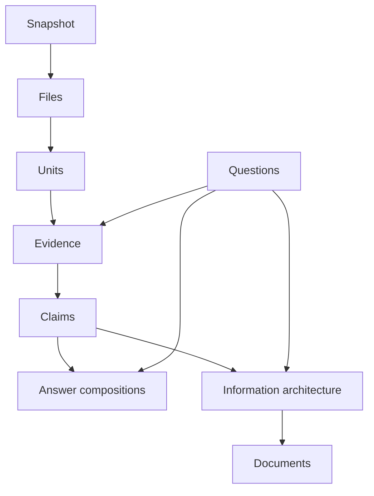
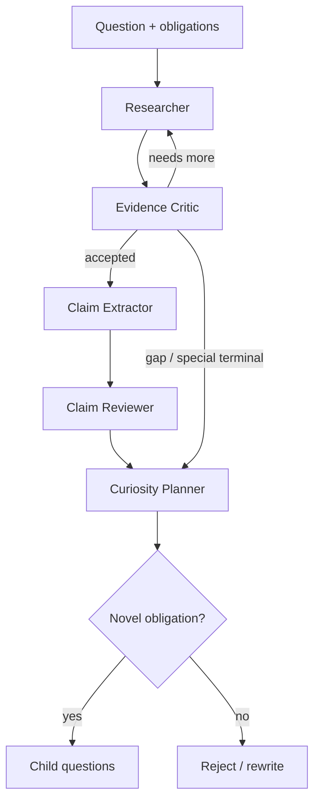

# Automatic ingestion v3

Ultradyn Docs adopts the verified v3 ingestion design through ADR 0005. The
byte-preserved, inert source bundle remains provenance only; repository-native
contracts and fixtures are reviewed adaptations.

## Load-bearing diagrams

**Change A — layered knowledge model.** Claims sit between evidence and all promotable prose; questions remain the demand/navigation layer feeding evidence and answer composition, never a fact container.

**Change B — Evidence Critic / Curiosity Planner split.** Bounded evidence judgment cannot create future work; obligation-bound curiosity runs only after a terminal verdict.

## Authority boundaries

The canonical `QuestionRecord.state` remains the only question lifecycle.
Source snapshots, source units, coverage obligations, evidence, claims, and
answer compositions are orthogonal ingestion records. Git is authoritative for
accepted logical records; machine-local projections and replay bytes are not.
Agents propose typed results, while deterministic services own writes, IDs,
transitions, priorities, idempotency, and graph validity.

Accepted logical ingestion records use one file per accepted logical record under
fixed portable roots such as `sources/snapshots/` and `ingest/claims/`. Replay
bytes, live events, leases, and derived indexes live under the machine-local
`.ultradyn/runtime/ingest/` boundary. Identifiers are content-derived or supplied
by an injected deterministic `IdGenerator.next(kind): string`; queue folders
remain projections rather than lifecycle authority.

## Agent isolation

A fresh Evidence Critic evaluates evidence without proposing child questions. A
fresh Claim Reviewer evaluates proposed claims without inheriting the Claim
Extractor context. Curiosity planning runs only after a terminal evidence
verdict and cannot revise that verdict. Answer composition consumes a sealed
accepted-claim pack and creates a distinct `AnswerComposition`; it does not
replace the transcript-derived Structured answer.

## Completion predicate

A question is never complete because ingestion exhausted a search. Completion
remains a canonical QuestionRecord transition and is blocked by any active P1
contradiction. Accepted claims and answer compositions are evidence products,
not lifecycle authorities.

Publication reuses the existing change-request manager. Fresh Reviewer,
diff-only Diff Summarizer, and post-diff Simulated Asker checks inspect the
actual diff before deterministic merge authorisation.

## Deferred activation

Semantic retrieval remains optional and cannot gate the lexical core. Source
custody deletion remains blocked until a dedicated ADR reconciles authorised
purge with append-only portable audit history. R2–R4 backlog phases remain
locked until their recorded release gates are satisfied.
